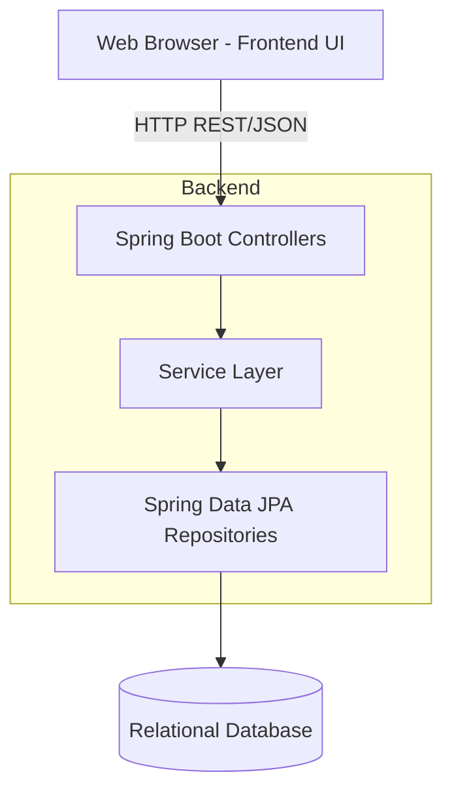
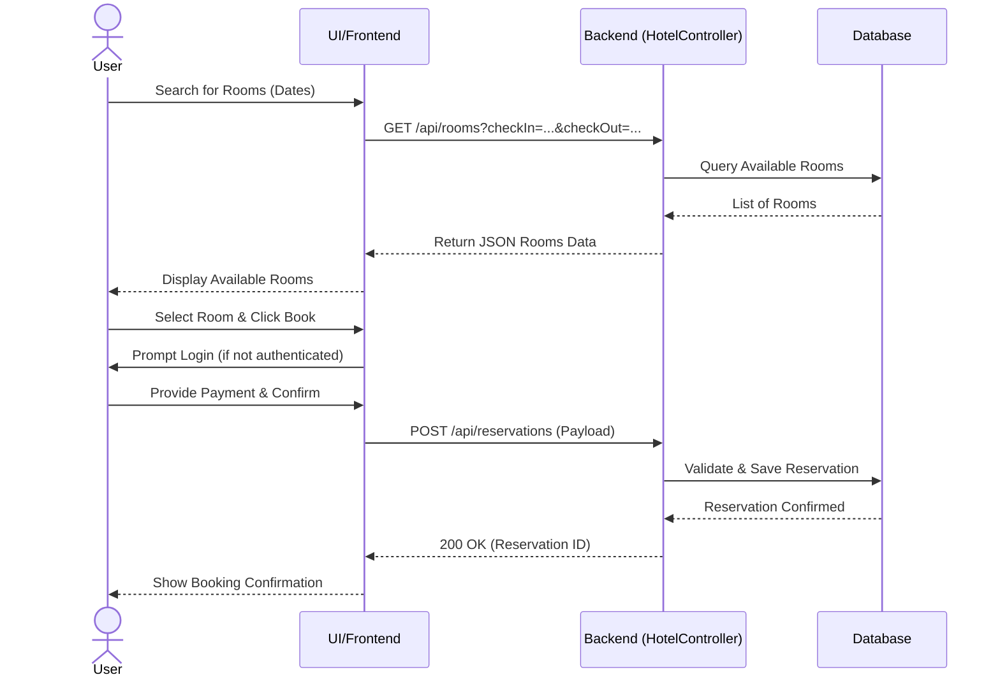
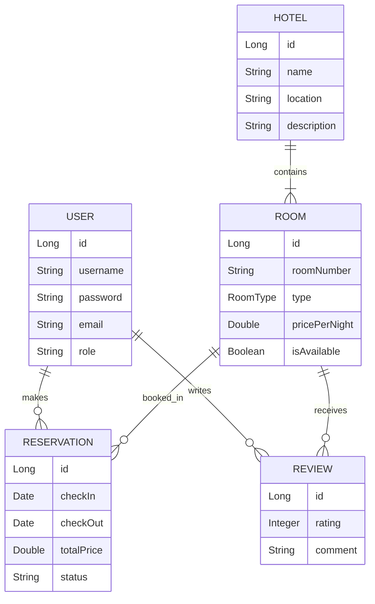

# Hotel Reservation System

A comprehensive and professional web application designed to handle hotel room bookings, user management, and administrative tasks. The system features a responsive frontend designed with HTML/CSS/JavaScript and a robust backend built with Java and Spring Boot.

---

## 🌟 Features

- **User Authentication:** Secure login and registration for users.
- **Room Search & Browsing:** View available rooms, check details, and filter by room types.
- **Booking & Reservations:** Seamless reservation flow including date selection and payment processing.
- **User Dashboard:** Manage past and upcoming bookings.
- **Admin Panel:** Administrative access to manage rooms, hotels, and all user reservations.
- **Reviews & Ratings:** Users can leave reviews for rooms they have stayed in.

---

## 💻 Tech Stack

- **Frontend:** HTML5, CSS3, Vanilla JavaScript
- **Backend:** Java, Spring Boot, Spring Web, Spring Data JPA
- **Build Tool:** Maven
- **Deployment:** Configured for Docker and Render (`render.yaml`)

---

## 🏗️ System Architecture

The following diagram illustrates the high-level architecture of the application:



---

## 🔄 Booking Algorithm Flow

The reservation process follows this sequential flow:



---

## 🗄️ Database Entity Relationship

The core data models and their relationships:



---

## 🚀 Getting Started

### Prerequisites
- Python 3.x (for running the frontend locally)
- Java 17+ (for backend)
- Maven (included via `mvnw`)

### Running the Backend

1. Navigate to the `backend` directory.
2. Run the Spring Boot application using the Maven wrapper:
   ```bash
   # On Windows
   .\mvnw.cmd spring-boot:run
   
   # On macOS/Linux
   ./mvnw spring-boot:run
   ```
3. The backend will start on `http://localhost:8080`.

### Running the Frontend

1. Navigate to the `frontend` directory.
2. Start a simple HTTP server (e.g., using Python):
   ```bash
   python -m http.server 3000
   ```
3. Open your browser and navigate to `http://localhost:3000`.

---

## 📁 Project Structure

```text
task 4/
├── backend/
│   ├── src/main/java/com/example/hotel/
│   │   ├── controller/      # REST API Endpoints
│   │   ├── model/           # JPA Entities (User, Room, Reservation)
│   │   ├── repository/      # Database Access Interfaces
│   │   └── service/         # Business Logic
│   └── pom.xml              # Maven dependencies
├── frontend/
│   ├── css/                 # Stylesheets
│   ├── js/                  # Frontend Logic
│   ├── img/                 # Assets
│   ├── index.html           # Home Page
│   └── ...                  # Other HTML views
└── render.yaml              # Deployment configuration
```
